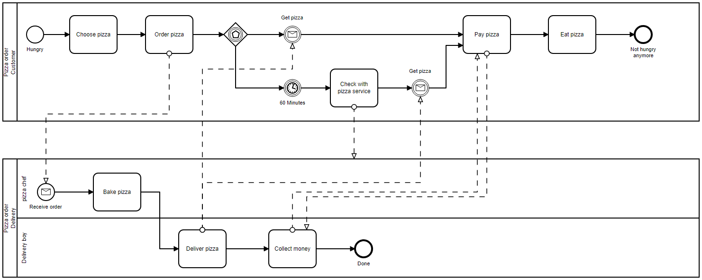
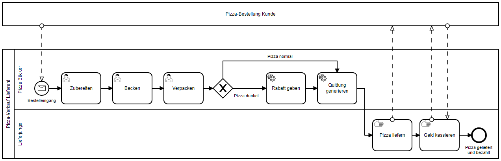

# camunda-voice-control

An integration of Amazon Alexa and [Camunda BPM Platform](https://github.com/camunda/camunda-bpm-platform).

I use Camunda BPM Platform integrated in Micronaut ([micronaut-camunda-bpm](https://github.com/camunda-community-hub/micronaut-camunda-bpm)).

## Introduction / Motivation

The following image shows a pizza delivery service process. I took it from the book of Rücker &
Freund.

> Source: Replicated from Page 98, Rücker, B., & Freund, J. (2019). Praxishandbuch BPMN 2.0: Mit Einführung in DMN. Carl Hanser Verlag GmbH Co KG.

However, we are only looking on the "service view" of the process. So we collapse the customer pool.
Also, we split the task "Bake pizza" in three different tasks and add a gateway which gives a
discount if the pizza got a bit burned.  

All of these steps will take place within the kitchen. For the moment, we assume that there is only
one pizza chef. And of course there is no computer with a display that the chef can use. So we place
an Amazon Alexa in his kitchen!

## Why use Camunda?

## Why use Alexa?

### What is the purpose of the skill?

> The purpose is the guiding principle that your dialogs should align to that trains the AI. For example, the cake skill lets you order custom cakes delivered to your door from the comfort of home.

- Interact with a user task (baking pizza)
- Provide information to the user about 'what to do now'

### What are the user's goals?

> What do they get out of this experience? Goals help you identify your core dialogs. For example, users can order a pizza pie with preset options or customize a pie to their liking.

- You can tell the system the state of your user task via voice
- Process participants get updates of this former manual process -> Better User Experience

## Contribution

### Requirements

- Git
- IntelliJ (or other IDE)
- Node + NPM
- Java (which you can also get via IntelliJ)

### Getting started

- Clone the repository with `git clone https://github.com/NovatecConsulting/camunda-voice-control.git`.
- Open a terminal in the cloned folder and enter `npm install`.
- Open the subfolder `pizza-service` with `IntelliJ`. The gradle build process should automatically start. It may take a while to download all dependencies.
- After a successfull build, start the application within IntelliJ. You should be able to open the camunda webapps in your browser on `http://localhost:8080`. Do that and log in with `username:admin` and `password:admin`.
- Create an account at [ngrok](https://ngrok.com/) and download the software. Unzip and place it within the root folder of the cloned project. Also, rename the folder to `ngrok`.
- Add the ngrok authtoken (see instruction on their website).
- Open a terminal there, run `npm run ngrok`. The service should provide you a `http` and a `https` endpoint. Open the `https` endpoint in a browser. You should see the camunda welcome screen.
- Open a terminal in the subfolder `skill-generator` and enter `npm install`.
- Start the skil-generator with `npm run dev` and open it at `http://localhost:3000` in your browser.
- Create yourself an alexa developer account [here](https://developer.amazon.com/en-US/alexa/alexa-skills-kit#). (You can also use your amazon account. If you own an alexa device, your skills will automatically be available on your device).
- Everything is ready to go. Create a process modell, run it through the skill-generator and follow its instructions for deployment. Enjoy!

### Conventional Commits

I use conventional [commit messages](https://github.com/conventional-changelog/commitlint/tree/master/%40commitlint/config-conventional). You can install it with:

1. `npm install`
2. `npx husky install` // Active hooks
3. `npx husky add .husky/commit-msg 'npx --no-install commitlint --edit $1'` // Add hook

Otherwise see [here](https://commitlint.js.org/#/guides-local-setup).

### BPMN's to PNG

1. `npm install -g bpmn-to-image`
2. `npm run generate-bpmn-png`
